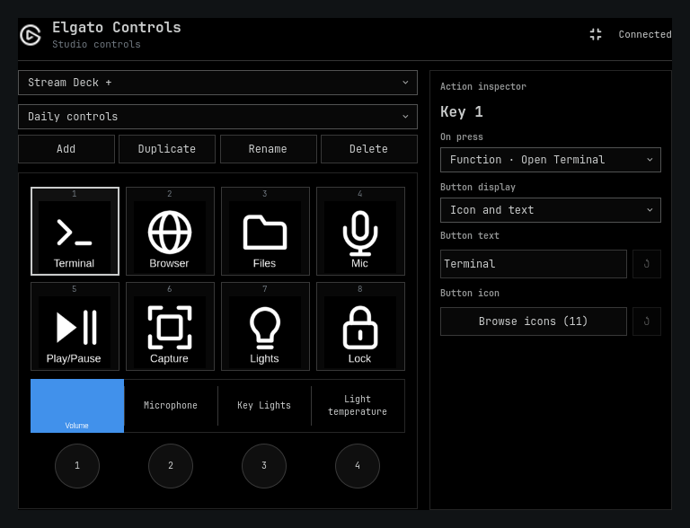

# Elgato Controls for Omarchy

Configure Stream Deck buttons and dials, customize their displays, and control
network Elgato Key Lights from the Omarchy Shell bar.



[Dial and LCD editor](docs/previews/dials.png) ·
[Key Light controls](docs/previews/key-lights.png)

## Features

- Configurable keys, dial turns, and dial presses with suitable action choices.
- Application launchers, audio and microphone controls, keyboard keys, workspace
  navigation, and grouped Key Light controls.
- Independent mappings, pages, and nested folders for each device model.
- Custom icons, captions, colors, and state-specific icons for toggle actions.
- Per-dial LCD artwork on the Stream Deck Plus and other LCD-capable models.
- Offline device previews and optional user-installed action packs.

Stream Deck communication uses
[`@elgato-stream-deck/node`](https://github.com/Julusian/node-elgato-stream-deck).
The interface uses QML and runs within Omarchy Shell; the backend uses Node.js.

## Requirements

- Omarchy Quattro with Omarchy Shell and the `omarchy plugin` commands.
- Node.js 22.18 or newer and npm.
- ImageMagick (`magick`), Fontconfig (`fc-match`), and an installed sans-serif font.
- USB access to the Stream Deck for the logged-in user; consult the device
  library's [USB permission instructions](https://github.com/Julusian/node-elgato-stream-deck).
- Avahi (`avahi-browse`) for network Key Light discovery.

Individual actions may require PipeWire/WirePlumber (`wpctl`), `wtype`,
`uwsm-app`, or another executable declared by an action pack. Missing optional
integrations do not install packages automatically.

## Install

Install and enable through Omarchy:

```bash
omarchy plugin add https://github.com/dxun-dev/omarchy-elgato.git --enable
```

Omarchy asks where to place the widget. On first enable, the service installs its
locked runtime dependencies in the user data directory. This requires internet
access and may take a moment. Click the Elgato icon when it appears to configure
your devices.

For an earlier development install, disable `omarchy-elgato` before enabling
this plugin. Existing profiles, icons, and action packs are preserved.

## Use and configure

Click the Elgato bar icon to open the editor. Choose a connected device or an
offline model, select a button or dial, and assign an action. Use the display
settings for icons, text, background colors, and dial LCD artwork. Stateful
actions expose an icon setting for each reported state; launchers keep a single
icon. **Detach** opens the editor in a separate window; **Dock** returns it to the
bar. Escape closes the editor or cancels an active edit.

Move the widget with:

```bash
omarchy bar move dxun-dev.omarchy-elgato --section left
```

See [the usage guide](docs/usage.md) for pages, folders, colors, status icons,
and CLI examples. See [action packs](docs/actions.md) to add your own actions.

## User files

All paths respect the corresponding XDG environment variable.

| Purpose | Default location |
| --- | --- |
| Mappings and pages | `~/.config/omarchy-elgato/profile.json` |
| Custom icons | `~/.config/omarchy-elgato/icons/` |
| Action packs | `~/.config/omarchy-elgato/actions/` |
| Status and discovered-light inventory | `~/.local/state/omarchy-elgato/` |
| Generated artwork cache | `~/.cache/omarchy-elgato/` |
| Runtime dependencies | `~/.local/share/omarchy-elgato/runtime/` |

`OMARCHY_ELGATO_RUNTIME` can override the dependency location.
`OMARCHY_ELGATO_FONT` can select a font file; otherwise Fontconfig resolves the
system's sans-serif font. Applications and icons use XDG data directories.

## Update

```bash
omarchy plugin update dxun-dev.omarchy-elgato
```

Omarchy reloads the plugin. The service refreshes runtime dependencies when
needed, preserving profiles, icons, action packs, and bar placement.

## Disable or remove

```bash
omarchy plugin disable dxun-dev.omarchy-elgato
omarchy plugin remove dxun-dev.omarchy-elgato
```

Disabling stops the daemon. Removal deletes or backs up the plugin through
Omarchy. User profiles, icons, action packs, state, cache, and runtime dependencies
remain available for reinstalling. To delete those too, first back up anything
you want to keep and remove the locations in **User files** manually. No system
files, packages, or USB rules are removed.

## Compatibility and limitations

Model layouts cover Classic variants, Plus, Mini, XL, Neo, Pedal, Studio, Plus XL,
and supported Modules. Multiple units of the same model share mappings and page
state. Additional models and dial LEDs have automated mock coverage; physical
hardware verification is incomplete. The Neo information screen has clock/date,
page, microphone mute, and light status. Touch gestures, automatic touch
navigation, Studio NFC, Network Dock transport, Wave-specific controls, and
Facecam controls are not implemented.

Action packs provide command actions and status queries. Live tile providers
and column reservations, such as Herdr agent columns, are future work.

## Troubleshooting

The editor shows runtime preparation progress and failure details. After
resolving the problem (for example, restoring internet access), click **Retry
setup**. For more detail, check `journalctl --user -t omarchy-shell`. You can also
retry through Omarchy:

```bash
omarchy plugin disable dxun-dev.omarchy-elgato
omarchy plugin enable dxun-dev.omarchy-elgato
```

For detailed diagnostics, run
`~/.config/omarchy/plugins/dxun-dev.omarchy-elgato/bin/elgato-control doctor`.
Manual `bin/elgato-control setup` remains available to repair the runtime.
USB permission failures require the appropriate device rule and a new login or
device reconnect. Network lights must be reachable on the local network and
discoverable through Avahi.

For action packs, run `bin/elgato-control action-packs`. Runtime and status-query
errors are reported by `bin/elgato-control status --json`. Shell load errors
appear in `journalctl --user -t omarchy-shell`.

## Development and publication

See [release notes](CHANGELOG.md) for version history.

See [development](docs/development.md) for builds, tests, local installation,
and validation. [Publication preparation](docs/publishing.md) records the
release validation and submission checklist.

## License and attribution

MIT licensed. This project began as a port of
[Amit Patel's Elgato Control](https://github.com/amitcpatel/omarchy-elgato-control).
The [license](LICENSE) and [third-party notices](THIRD_PARTY_NOTICES.md)
are retained. Elgato product names identify compatible hardware and do not imply
endorsement or affiliation.
